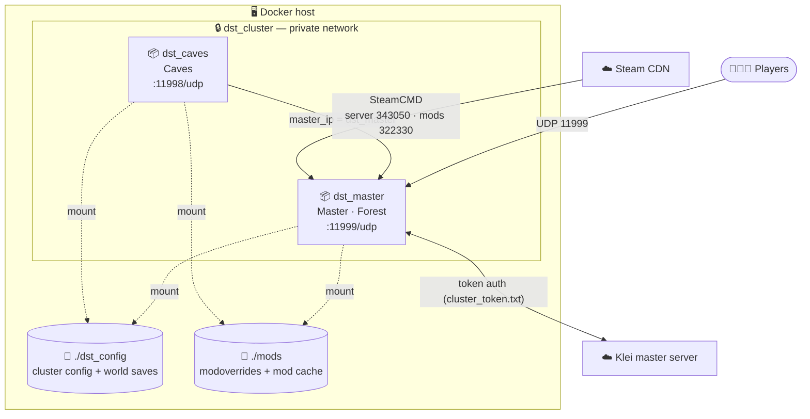

<div align="center">

# 🔥 Don't Starve Together — Docker Dedicated Server

**Spin up a full two-shard (Forest + Caves) DST cluster with one command.**
Mods that actually download, persistent saves, and a non-root container — all batteries included.

[](https://www.docker.com/)
[](https://www.debian.org/)
[](https://docs.docker.com/compose/)
[](https://www.klei.com/games/dont-starve-together)
[](#-contributing)

**English** · [中文](readme_cn.md)

</div>

---

## 📖 Table of Contents

- [Why this project?](#-why-this-project)
- [Features](#-features)
- [Architecture](#-architecture)
- [How it works](#-how-it-works)
- [Prerequisites](#-prerequisites)
- [Quick Start](#-quick-start)
- [Configuration Reference](#-configuration-reference)
- [Managing the Server](#-managing-the-server)
- [Mods Deep-Dive](#-mods-deep-dive)
- [Troubleshooting](#-troubleshooting)
- [FAQ](#-faq)
- [Project Structure](#-project-structure)
- [Credits & References](#-credits--references)

---

## 🤔 Why this project?

Running a Don't Starve Together dedicated server by hand means installing SteamCMD, juggling 32-bit
libraries, wiring two shards together, fighting the in-game mod downloader, and remembering where Klei
hides every config file. This repo wraps all of that into a tiny Docker image plus a handful of
well-commented config templates, so you can go from `git clone` to a running **Forest + Caves**
cluster in a few minutes — and understand exactly what every piece does along the way.

It's deliberately small and readable: one `Dockerfile`, one `docker-compose.yml`, one `start.sh`, and
config files that mirror what Klei's own server uses. Nothing is hidden behind magic.

## ✨ Features

- 🗺️ **Two-shard cluster out of the box** — Master (Forest) + Caves, linked over a private Docker network.
- 🧩 **Mods that actually install** — Workshop mods are pre-downloaded with SteamCMD to dodge the dedicated server's hard-coded **16-second** mod-download timeout that fails on slow/blocked networks.
- 💾 **Persistent saves & mod cache** — worlds and downloaded mods live on host folders, so rebuilds and updates never wipe your progress.
- 🔄 **Self-updating game** — the DST server is downloaded at boot, not baked into the image; just restart to update.
- 🔒 **Runs as a non-root user** — the container drops to an unprivileged `dst` user.
- 🪟 **Linux, macOS & Windows** — anywhere Docker runs (see the [Windows note](#-prerequisites)).
- 📝 **Readable & documented** — every key file is commented so you can learn and customize with confidence.

## 🏗️ Architecture

A DST *cluster* is one world split across two *shards*. Each shard runs as its own container; both
build from the same image and share the same config and mods folders. They find each other by
container name on a private Docker network — no hard-coded IPs.



| Piece | What it is |
| --- | --- |
| `dst_master` | The surface world (Forest). Players connect here, on UDP **11999**. |
| `dst_caves` | The underground world. Attaches to the master; starts after it. UDP **11998**. |
| `dst_cluster` | Private Docker network letting the shards talk by name. |
| `./dst_config` | Cluster-wide config (`cluster.ini`, token, player lists) **and** world saves. |
| `./mods` | Your `modoverrides.lua` and the downloaded Workshop mods (cached). |

## ⚙️ How it works

When a container starts, [`start.sh`](start.sh) runs four phases (watch them live with
`docker compose logs -f`):

1. **Install / update the game.** SteamCMD downloads the DST dedicated server (Steam appid **343050**)
   into the persistent `DST/` folder and validates it. Because the game isn't baked into the image,
   restarting the container is all it takes to update to the latest version.
2. **Distribute mod config.** `mods/modoverrides.lua` is copied into both the `Master/` and `Caves/`
   shard folders so a single file controls mods for the whole cluster.
3. **Pre-download mods.** The script reads every `enabled` `workshop-<id>` from `modoverrides.lua` and
   fetches each one with SteamCMD (Workshop appid **322330**). This is the headline trick: the
   dedicated server's own downloader gives up after ~16 seconds, which fails constantly on slow or
   restricted networks. SteamCMD has no such limit and resumes partial downloads, and the results are
   cached in `./mods`, so subsequent boots are instant.
4. **Launch the shard.** It runs `dontstarve_dedicated_server_nullrenderer -shard $SHARD_NAME
   -skip_update_server_mods`, where `$SHARD_NAME` (`Master` or `Caves`) is set per-service in
   `docker-compose.yml`. `-skip_update_server_mods` tells the server not to re-fetch the mods we
   already downloaded.

## 📋 Prerequisites

- **Docker** and the **Docker Compose v2** plugin. ([Install Docker](https://docs.docker.com/get-docker/))
- A **Klei server token** so your server can appear online (skip it only for offline/LAN play — see
  [`cluster.ini`](#cluster-wide-settings--clusterini)). Generate one at
  **[accounts.klei.com](https://accounts.klei.com/) → Game Servers**.
- An open **UDP** port for the master shard (default **11999**) — forward it on your router if you want
  friends to join over the internet. DST uses **UDP only**, never TCP.
- 🪟 **Windows:** install **Docker Desktop** (WSL 2 backend) — this project runs fine on it. Run
  `setup.sh` from **Git Bash** or **WSL**, or just copy the `*.example` files by hand (see Quick Start).
- 🍎 **Apple Silicon (M-series) note:** DST is an x86/i386-only binary, so it does not run natively on
  ARM Macs. An Intel/AMD host (or x86 VM/server) is recommended.

## 🚀 Quick Start

```bash
# 1. Clone the repo
git clone https://github.com/chendaile/dontstarvetogether-server-linux-docker.git
cd dontstarvetogether-server-linux-docker

# 2. Create the real config files from the templates (safe to re-run; never overwrites)
./setup.sh
#    On Windows without Git Bash/WSL, instead copy each *.example to the same name
#    without ".example" (e.g. dst_config/cluster.ini.example -> dst_config/cluster.ini).

# 3. Paste your Klei token into the token file (one line, no quotes)
#    Get it at https://accounts.klei.com -> Game Servers
nano dst_config/cluster_token.txt

# 4. Name your server (and optionally set a password)
nano dst_config/cluster.ini      # set cluster_name = My Awesome Server

# 5. Launch the cluster (builds the image the first time)
docker compose up -d

# 6. Watch it install the game, fetch mods, and start up
docker compose logs -f
```

The **first** boot downloads the ~3 GB server and any mods, so give it a few minutes. Once the logs
show the shards running, open Don't Starve Together → **Browse Games**, search for your `cluster_name`,
and join. 🎉

> 💡 **Customize ports / container names?** `cp .env.example .env` (or let `setup.sh` do it) and edit
> the values. If you rename the master container, also update `master_ip` in `cluster.ini` to match —
> see [Troubleshooting](#-troubleshooting).

## 🔧 Configuration Reference

Everything you edit lives in two host folders that are mounted into the containers: `dst_config/`
(cluster config + saves) and `mods/` (mods). Files use a `*.example` template convention — `setup.sh`
copies each template to its real name, and the real names are git-ignored so your secrets and saves are
never committed.

### Ports & names — `.env`

`docker compose` reads `.env` automatically. Every value is optional and has a built-in default.

| Variable | Default | Meaning |
| --- | --- | --- |
| `MASTER_NAME` | `dst_master` | Master container name. ⚠️ If you change this, also set `master_ip` in `cluster.ini` to the same value. |
| `MASTER_PORT` | `11999` | Host UDP port for the master shard (the one players connect to). |
| `CAVES_NAME` | `dst_caves` | Caves container name. |
| `CAVES_PORT` | `11998` | Host UDP port for the caves shard. |

### Cluster-wide settings — `cluster.ini`

Shared by both shards. Full template with inline docs: [`dst_config/cluster.ini.example`](dst_config/cluster.ini.example).
The most common knobs:

| Section | Key | Default | Notes |
| --- | --- | --- | --- |
| `[NETWORK]` | `cluster_name` | *(empty)* | **Required.** Name shown in the server browser. |
| `[NETWORK]` | `cluster_description` | *(empty)* | Free-text description. |
| `[NETWORK]` | `cluster_password` | *(empty)* | Leave empty for a public server. |
| `[NETWORK]` | `cluster_intention` | `cooperative` | `cooperative` · `competitive` · `social` · `madness`. |
| `[GAMEPLAY]` | `game_mode` | `survival` | `survival` · `endless` · `wilderness`. |
| `[GAMEPLAY]` | `max_players` | `16` | 1–64. |
| `[GAMEPLAY]` | `pvp` | `false` | Player-vs-player damage. |
| `[GAMEPLAY]` | `pause_when_empty` | `true` | Pause the world when nobody is online. |
| `[MISC]` | `max_snapshots` | `6` | How many rollback points to keep. |
| `[SHARD]` | `cluster_key` | *(set me)* | Shared secret linking the shards. Same file → same key for both. |
| `[SHARD]` | `bind_ip` | `0.0.0.0` | Leave as-is for Docker. |
| `[SHARD]` | `master_ip` | `dst_master` | The master **container name**. Must match `MASTER_NAME`. |

> 🛜 **Offline / LAN only?** Uncomment `offline_server = true` in `[NETWORK]` to skip the Klei token.
> Your server won't be listed publicly but is still joinable on the local network.

### Per-shard settings — `server.ini`

Each shard has a small identity file: [`dst_config/Master/server.ini`](dst_config/Master/server.ini)
and [`dst_config/Caves/server.ini`](dst_config/Caves/server.ini). They set `is_master`, the shard
`name`, the internal `server_port`, and (for Caves) a fixed `id`. **Don't change the Caves `id` after
the world is created** — the master uses it to recognize the caves shard.

### Who can play — admin / whitelist / block lists

Three optional, one-ID-per-line files under `dst_config/`:

| File | Effect |
| --- | --- |
| `adminlist.txt` | These players get admin powers (console, `~` menu). |
| `whitelist.txt` | If non-empty, **only** these players may join. |
| `blocklist.txt` | These players are banned. |

The IDs are **Klei User IDs** that look like `KU_xxxxxxxx`. The easiest way to find a player's ID: have
them join once, then look for the `KU_...` next to their name in `docker compose logs`. Edit the file,
then `docker compose restart`.

### World customization — `leveldataoverride.lua`

`dst_config/Master/leveldataoverride.lua` and `dst_config/Caves/leveldataoverride.lua` control world
generation (creatures, resources, seasons, size, …). The easiest way to author one is the in-game
**Host Game** screen: tweak the world, host once, then copy the generated file in. See the header
comments inside each [`.example`](dst_config/Master/leveldataoverride.lua.example) for the field map.

## 🎮 Managing the Server

```bash
docker compose up -d            # start the cluster in the background
docker compose logs -f          # follow logs (all shards)
docker compose logs -f dst_master   # follow just the master
docker compose restart          # restart (also re-runs SteamCMD → updates DST)
docker compose stop             # stop without removing containers
docker compose down             # stop and remove containers (saves/mods are on disk, safe)
docker compose up -d dst_master # run the master shard only (no caves)
```

**Update the game:** because the server is downloaded at boot, a simple `docker compose restart` pulls
the latest DST build. Klei pushes mandatory updates often — restart if players can't connect after a
patch.

**Admin / console commands:** add your `KU_...` ID to `dst_config/adminlist.txt`, restart, then in-game
press `~` to open the console. Handy ones: `c_announce("message")`, `c_save()`, `c_rollback(1)`,
`c_shutdown()`, `c_listallplayers()`.

**Back up your worlds:** the saves are plain files under `dst_config/Master/save` and
`dst_config/Caves/save`. Snapshot the whole config folder (ideally while stopped):

```bash
docker compose stop
tar czf dst-backup-$(date +%F).tgz dst_config
docker compose start
```

## 🧩 Mods Deep-Dive

Mods are configured in **one** file, [`mods/modoverrides.lua`](mods/modoverrides.lua.example), which
`start.sh` copies to both shards. To add a Workshop mod:

1. Find its Workshop ID — the number in the Steam Workshop URL
   (`.../filedetails/?id=`**`375850593`**).
2. Add an entry and set `enabled=true`:

   ```lua
   return {
     -- Extra Equip Slots
     ["workshop-375850593"]={ configuration_options={ }, enabled=true },
   }
   ```

3. `docker compose restart`. On boot the script pre-downloads the mod (no 16s timeout) and caches it
   under `mods/workshop-375850593`.

**Per-mod settings** go in `configuration_options={ ... }`; the keys are mod-specific (copy them from
the mod's Workshop page or its `modinfo.lua`). **To remove a mod**, set `enabled=false` or delete its
entry. To force a fresh re-download, delete its `mods/workshop-<id>` folder and restart.

## 🛠️ Troubleshooting

<details>
<summary><b>The server doesn't show up in the Browse Games list</b></summary>

- Make sure `dst_config/cluster_token.txt` contains a valid Klei token (one line, no quotes).
- The first boot can take several minutes to download the game — check `docker compose logs -f`.
- New servers can take a little while to register with Klei; also try clearing browser filters.
- If `offline_server = true` is set in `cluster.ini`, the server is intentionally hidden (LAN only).
</details>

<details>
<summary><b>Friends can't connect over the internet</b></summary>

- Forward **UDP** `11999` (your `MASTER_PORT`) on your router to the host running Docker.
- Confirm the host firewall allows inbound UDP on that port. DST never uses TCP.
</details>

<details>
<summary><b>The Caves shard won't connect to the Master</b></summary>

- The shards link via `master_ip` in `cluster.ini`, which must equal the master **container name**.
  If you set `MASTER_NAME` in `.env`, update `master_ip` to match it.
- Both shards share one `cluster.ini`, so `cluster_key` is automatically identical — don't split it.
- The caves container starts after the master (`depends_on`); give the master a moment on first boot.
</details>

<details>
<summary><b>A mod fails to download</b></summary>

- Check the logs for `workshop content not found` — usually a wrong/removed Workshop ID, or a
  client-only mod that has no server files.
- Verify the ID matches the Workshop URL and that `enabled=true`.
- Delete `mods/workshop-<id>` and restart to force a clean re-download.
</details>

<details>
<summary><b><code>ERROR: DST binary not found</code> on startup</b></summary>

- SteamCMD couldn't install the game — almost always a network issue or an unwritable volume.
- Re-run `docker compose up` to retry; check the SteamCMD output earlier in the logs.
</details>

## ❓ FAQ

**Do I need the Caves shard?** No. Run only the surface world with `docker compose up -d dst_master`.

**Where are my save files?** `dst_config/Master/save` and `dst_config/Caves/save`. Back them up by
copying the `dst_config` folder.

**How do I make myself an admin?** Put your `KU_...` ID in `dst_config/adminlist.txt` and restart.

**Does it run on Windows?** Yes — Docker Desktop with the WSL 2 backend. Run `setup.sh` via Git Bash or
WSL, or copy the `*.example` templates manually.

**Does it run on Apple Silicon?** Not natively — DST is x86/i386 only. Use an Intel/AMD host.

**Will updating wipe my world?** No. The game and mods are re-downloaded, but your `dst_config` saves
persist on the host.

## 📂 Project Structure

```text
.
├── Dockerfile                     # Builds the image: SteamCMD + 32-bit libs, non-root user
├── docker-compose.yml             # Defines the dst_master + dst_caves services and network
├── start.sh                       # Container entrypoint: install game → fetch mods → run shard
├── setup.sh                       # One-time host helper: creates real config files from templates
├── .env.example                   # Optional port/name overrides (copy to .env)
├── dst_config/                    # ── Mounted as the cluster folder (config + saves) ──
│   ├── cluster.ini.example        # Cluster-wide settings (name, password, gameplay, sharding)
│   ├── cluster_token.txt.example  # Your Klei server token goes here
│   ├── adminlist.txt.example      # Admin KU_ IDs
│   ├── whitelist.txt.example      # Whitelist KU_ IDs (if used)
│   ├── blocklist.txt.example      # Banned KU_ IDs
│   ├── Master/
│   │   ├── server.ini             # Master shard identity + port
│   │   └── leveldataoverride.lua.example   # Forest world generation
│   └── Caves/
│       ├── server.ini             # Caves shard identity + port + fixed id
│       └── leveldataoverride.lua.example   # Caves world generation
└── mods/                          # ── Mounted as the mods folder ──
    └── modoverrides.lua.example   # Enable & configure Workshop mods (one source of truth)
```

## 🙌 Contributing

Issues and pull requests are welcome — whether it's a doc fix, a new config example, or a feature.
Please keep the key files commented in the same teaching style as the rest of the repo.

## 📚 Credits & References

- [Klei — Dedicated Server Settings Guide](https://forums.kleientertainment.com/topic/64552-dedicated-server-settings-guide/)
- [Klei — Dedicated Server Quick Setup (Linux)](https://forums.kleientertainment.com/forums/topic/64441-dedicated-server-quick-setup-guide-linux/)
- [Steam Workshop — Don't Starve Together](https://steamcommunity.com/app/322330/workshop/)
- [SteamCMD documentation](https://developer.valvesoftware.com/wiki/SteamCMD)

> Don't Starve Together is a trademark of Klei Entertainment. This is an unofficial, community
> deployment and is not affiliated with or endorsed by Klei.
