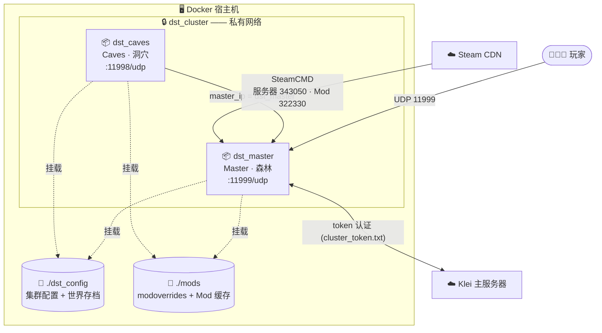

<div align="center">

# 🔥 饥荒联机版（DST）—— Docker 专用服务器

**一条命令拉起一个完整的双分片（地上森林 + 洞穴）DST 集群。**
Mod 真的能下下来、存档持久化、容器以非 root 运行 —— 开箱即用。

[](https://www.docker.com/)
[](https://www.debian.org/)
[](https://docs.docker.com/compose/)
[](https://www.klei.com/games/dont-starve-together)
[](#-参与贡献)

[English](README.md) · **中文**

</div>

---

## 📖 目录

- [为什么用这个项目](#-为什么用这个项目)
- [功能特性](#-功能特性)
- [架构](#-架构)
- [工作原理](#-工作原理)
- [前置要求](#-前置要求)
- [快速开始](#-快速开始)
- [配置参考](#-配置参考)
- [服务器管理](#-服务器管理)
- [Mod 详解](#-mod-详解)
- [故障排查](#-故障排查)
- [常见问题](#-常见问题)
- [项目结构](#-项目结构)
- [致谢与参考](#-致谢与参考)

---

## 🤔 为什么用这个项目

手动搭一个饥荒联机版专用服务器，意味着你要装 SteamCMD、折腾 32 位运行库、把两个分片连起来、和游戏内的
Mod 下载器斗智斗勇，还得记住 Klei 把每个配置文件藏在了哪里。这个仓库把上述所有事情都打包进一个很小的
Docker 镜像，外加一组注释完善的配置模板 —— 让你从 `git clone` 到跑起一个 **森林 + 洞穴** 集群只需几分钟，
而且一路上每个部件在做什么你都看得明明白白。

它刻意保持小而易读：一个 `Dockerfile`、一个 `docker-compose.yml`、一个 `start.sh`，以及与 Klei 官方服务器
一致的配置文件。没有任何藏在魔法背后的东西。

## ✨ 功能特性

- 🗺️ **开箱即用的双分片集群** —— Master（森林）+ Caves（洞穴），通过私有 Docker 网络互联。
- 🧩 **Mod 真的装得上** —— 用 SteamCMD 预先下载创意工坊 Mod，绕开专用服务器那个写死的 **16 秒** Mod 下载超时（在慢速 / 受限网络下几乎必失败）。
- 💾 **存档与 Mod 缓存持久化** —— 世界和已下载的 Mod 都放在宿主机目录里，重建、更新都不会清掉你的进度。
- 🔄 **游戏自动更新** —— DST 服务器是在启动时下载的，并未打进镜像；想更新只要重启即可。
- 🔒 **以非 root 用户运行** —— 容器内降权到无特权的 `dst` 用户。
- 🪟 **Linux、macOS 与 Windows** —— 只要能跑 Docker 就能用（见 [Windows 说明](#-前置要求)）。
- 📝 **可读、有注释** —— 每个关键文件都加了注释，方便你放心地学习与定制。

## 🏗️ 架构

一个 DST *集群（cluster）* 就是被拆成两个 *分片（shard）* 的同一个世界。每个分片各跑在一个容器里；两者都
基于同一个镜像构建，并共享同一份配置和 Mod 目录。它们通过私有 Docker 网络里的容器名互相发现 —— 不写死任何
IP。



| 部件 | 是什么 |
| --- | --- |
| `dst_master` | 地上世界（森林）。玩家连这里，UDP **11999**。 |
| `dst_caves` | 地下世界（洞穴）。附属于 master，在它之后启动。UDP **11998**。 |
| `dst_cluster` | 私有 Docker 网络，让两个分片按名字互相通信。 |
| `./dst_config` | 集群级配置（`cluster.ini`、令牌、玩家名单）**以及**世界存档。 |
| `./mods` | 你的 `modoverrides.lua` 和下载好的创意工坊 Mod（带缓存）。 |

## ⚙️ 工作原理

容器启动时，[`start.sh`](start.sh) 会执行四个阶段（用 `docker compose logs -f` 可实时观看）：

1. **安装 / 更新游戏。** SteamCMD 把 DST 专用服务器（Steam appid **343050**）下载到持久化的 `DST/` 目录并校验。
   由于游戏没有打进镜像，重启容器就能更新到最新版本。
2. **分发 Mod 配置。** 把 `mods/modoverrides.lua` 复制到 `Master/` 和 `Caves/` 两个分片目录，于是一份文件即可
   控制整个集群的 Mod。
3. **预下载 Mod。** 脚本读取 `modoverrides.lua` 中每个 `enabled` 的 `workshop-<id>`，用 SteamCMD（创意工坊
   appid **322330**）逐个下载。这就是最关键的技巧：专用服务器自带的下载器约 16 秒后就会放弃，在慢速或受限
   网络下经常失败。SteamCMD 没有这个限制，还能续传，且结果缓存在 `./mods` 里，所以后续启动几乎瞬间完成。
4. **启动分片。** 执行 `dontstarve_dedicated_server_nullrenderer -shard $SHARD_NAME -skip_update_server_mods`，
   其中 `$SHARD_NAME`（`Master` 或 `Caves`）由 `docker-compose.yml` 为每个服务分别设置。
   `-skip_update_server_mods` 告诉服务器不要再去重新拉取我们已经下好的 Mod。

## 📋 前置要求

- **Docker** 以及 **Docker Compose v2** 插件。（[安装 Docker](https://docs.docker.com/get-docker/)）
- 一个 **Klei 服务器令牌**，让你的服务器能上线显示（只有纯离线 / 局域网玩法才可省略 —— 见
  [`cluster.ini`](dst_config/cluster.ini.example)）。在
  **[accounts.klei.com](https://accounts.klei.com/) → Game Servers** 生成。
- 为 master 分片开放一个 **UDP** 端口（默认 **11999**）—— 想让朋友通过公网加入，就在路由器上做端口转发。
  DST **只用 UDP**，绝不用 TCP。
- 🪟 **Windows：** 安装 **Docker Desktop**（WSL 2 后端）—— 本项目在它上面运行良好。请通过 **Git Bash** 或
  **WSL** 运行 `setup.sh`，或者手动复制各个 `*.example` 文件（见快速开始）。
- 🍎 **Apple Silicon（M 系列）提示：** DST 是仅 x86/i386 的程序，无法在 ARM 架构的 Mac 上原生运行。建议使用
  Intel/AMD 主机（或 x86 虚拟机 / 服务器）。

## 🚀 快速开始

```bash
# 1. 克隆仓库
git clone https://github.com/chendaile/dontstarvetogether-server-linux-docker.git
cd dontstarvetogether-server-linux-docker

# 2. 从模板生成真正的配置文件（可重复运行；绝不覆盖已有文件）
./setup.sh
#    Windows 上若没有 Git Bash/WSL，则手动把每个 *.example 复制成去掉 ".example" 的同名文件
#    （例如 dst_config/cluster.ini.example -> dst_config/cluster.ini）。

# 3. 把你的 Klei 令牌粘进令牌文件（一行，不要引号）
#    在 https://accounts.klei.com -> Game Servers 获取
nano dst_config/cluster_token.txt

# 4. 给服务器起个名字（也可顺便设密码）
nano dst_config/cluster.ini      # 设置 cluster_name = My Awesome Server

# 5. 启动集群（首次会构建镜像）
docker compose up -d

# 6. 观看它安装游戏、拉取 Mod、并启动
docker compose logs -f
```

**首次**启动要下载约 3 GB 的服务器以及各 Mod，请耐心等几分钟。当日志显示分片已运行后，打开饥荒联机版 →
**浏览游戏（Browse Games）**，搜索你的 `cluster_name` 并加入即可。🎉

> 💡 **想自定义端口 / 容器名？** 执行 `cp .env.example .env`（或让 `setup.sh` 帮你复制）再改里面的值。
> 如果你改了 master 容器名，记得把 `cluster.ini` 里的 `master_ip` 也改成同样的值 —— 见
> [故障排查](#-故障排查)。

## 🔧 配置参考

你要改的一切都在两个挂载进容器的宿主机目录里：`dst_config/`（集群配置 + 存档）与 `mods/`（Mod）。文件采用
`*.example` 模板约定 —— `setup.sh` 会把每个模板复制成正式名字，而正式名字都已被 git 忽略，所以你的密钥和
存档绝不会被提交。

### 端口与名称 —— `.env`

`docker compose` 会自动读取 `.env`。每个值都可选，且都有内置默认值。

| 变量 | 默认值 | 含义 |
| --- | --- | --- |
| `MASTER_NAME` | `dst_master` | master 容器名。⚠️ 改了它，就要把 `cluster.ini` 里的 `master_ip` 也设成同样的值。 |
| `MASTER_PORT` | `11999` | master 分片在宿主机上的 UDP 端口（玩家连接的就是它）。 |
| `CAVES_NAME` | `dst_caves` | caves 容器名。 |
| `CAVES_PORT` | `11998` | caves 分片在宿主机上的 UDP 端口。 |

### 集群级设置 —— `cluster.ini`

两个分片共用。带行内注释的完整模板见
[`dst_config/cluster.ini.example`](dst_config/cluster.ini.example)。最常用的几项：

| 区块 | 键 | 默认值 | 说明 |
| --- | --- | --- | --- |
| `[NETWORK]` | `cluster_name` | *(空)* | **必填。** 显示在服务器列表里的名字。 |
| `[NETWORK]` | `cluster_description` | *(空)* | 自由文本描述。 |
| `[NETWORK]` | `cluster_password` | *(空)* | 留空即为公开服务器。 |
| `[NETWORK]` | `cluster_intention` | `cooperative` | `cooperative` · `competitive` · `social` · `madness`。 |
| `[GAMEPLAY]` | `game_mode` | `survival` | `survival` · `endless` · `wilderness`。 |
| `[GAMEPLAY]` | `max_players` | `16` | 1–64。 |
| `[GAMEPLAY]` | `pvp` | `false` | 玩家间是否能互相造成伤害。 |
| `[GAMEPLAY]` | `pause_when_empty` | `true` | 无人在线时暂停世界。 |
| `[MISC]` | `max_snapshots` | `6` | 保留多少个回滚存档点。 |
| `[SHARD]` | `cluster_key` | *(请修改)* | 连接两个分片的共享密钥。同一份文件 → 两边自动一致。 |
| `[SHARD]` | `bind_ip` | `0.0.0.0` | Docker 下保持不变即可。 |
| `[SHARD]` | `master_ip` | `dst_master` | master 的**容器名**。必须与 `MASTER_NAME` 一致。 |

> 🛜 **只玩离线 / 局域网？** 在 `[NETWORK]` 里取消注释 `offline_server = true` 即可省去 Klei 令牌。
> 你的服务器不会公开列出，但局域网内仍可加入。

### 分片级设置 —— `server.ini`

每个分片都有一个小小的身份文件：[`dst_config/Master/server.ini`](dst_config/Master/server.ini) 和
[`dst_config/Caves/server.ini`](dst_config/Caves/server.ini)。它们设置 `is_master`、分片 `name`、内部
`server_port`，以及（Caves 才有的）固定 `id`。**世界创建之后不要改 Caves 的 `id`** —— master 靠它来认出
洞穴分片。

### 谁能进服 —— 管理员 / 白名单 / 黑名单

`dst_config/` 下有三个可选文件，每行一个 ID：

| 文件 | 作用 |
| --- | --- |
| `adminlist.txt` | 这些玩家拥有管理员权限（控制台、`~` 菜单）。 |
| `whitelist.txt` | 非空时，**只有**这些玩家能进服。 |
| `blocklist.txt` | 这些玩家被封禁。 |

这些 ID 是形如 `KU_xxxxxxxx` 的 **Klei 用户 ID**。找某个玩家 ID 最简单的办法：让他先进一次服，然后在
`docker compose logs` 里找他名字旁边的 `KU_...`。改完文件后执行 `docker compose restart`。

### 世界定制 —— `leveldataoverride.lua`

`dst_config/Master/leveldataoverride.lua` 与 `dst_config/Caves/leveldataoverride.lua` 控制世界生成（生物、
资源、季节、大小……）。最简单的做法是用游戏内的 **创建游戏（Host Game）** 界面：在那里调好世界、开一次房，
然后把生成的文件复制进来。字段说明见每个 [`.example`](dst_config/Master/leveldataoverride.lua.example) 文件
顶部的注释。

## 🎮 服务器管理

```bash
docker compose up -d            # 后台启动集群
docker compose logs -f          # 跟踪日志（所有分片）
docker compose logs -f dst_master   # 只看 master
docker compose restart          # 重启（同时重跑 SteamCMD → 更新 DST）
docker compose stop             # 停止但不删除容器
docker compose down             # 停止并删除容器（存档/Mod 在磁盘上，安全）
docker compose up -d dst_master # 只跑 master 分片（不开洞穴）
```

**更新游戏：** 由于服务器是在启动时下载的，简单一句 `docker compose restart` 就会拉取最新的 DST 版本。Klei
经常推送强制更新 —— 打补丁后玩家连不上时就重启一下。

**管理员 / 控制台命令：** 把你的 `KU_...` ID 加进 `dst_config/adminlist.txt`，重启，然后在游戏里按 `~` 打开
控制台。常用命令：`c_announce("消息")`、`c_save()`、`c_rollback(1)`、`c_shutdown()`、`c_listallplayers()`。

**备份世界：** 存档就是 `dst_config/Master/save` 和 `dst_config/Caves/save` 下的普通文件。把整个配置目录打个
快照（最好停服时做）：

```bash
docker compose stop
tar czf dst-backup-$(date +%F).tgz dst_config
docker compose start
```

## 🧩 Mod 详解

Mod 全在**一个**文件里配置：[`mods/modoverrides.lua`](mods/modoverrides.lua.example)，`start.sh` 会把它复制
到两个分片。添加一个创意工坊 Mod：

1. 找到它的工坊 ID —— 就是 Steam 工坊链接里的那串数字
   （`.../filedetails/?id=`**`375850593`**）。
2. 添加一条记录并设 `enabled=true`：

   ```lua
   return {
     -- Extra Equip Slots
     ["workshop-375850593"]={ configuration_options={ }, enabled=true },
   }
   ```

3. `docker compose restart`。启动时脚本会预下载该 Mod（没有 16 秒超时），并缓存到 `mods/workshop-375850593`。

**单个 Mod 的设置**写在 `configuration_options={ ... }` 里；其中的键由各 Mod 自定（从 Mod 的工坊页面或其
`modinfo.lua` 里抄过来）。**要移除一个 Mod**，把它设为 `enabled=false` 或删掉整条记录。要强制重新下载，删除
对应的 `mods/workshop-<id>` 目录再重启。

## 🛠️ 故障排查

<details>
<summary><b>服务器没出现在「浏览游戏」列表里</b></summary>

- 确认 `dst_config/cluster_token.txt` 里是有效的 Klei 令牌（一行，不要引号）。
- 首次启动要下载游戏，可能要好几分钟 —— 用 `docker compose logs -f` 查看。
- 新服务器向 Klei 注册可能需要一点时间；也可以清掉浏览器里的筛选条件再看。
- 如果 `cluster.ini` 里设了 `offline_server = true`，服务器是故意被隐藏的（仅局域网）。
</details>

<details>
<summary><b>朋友通过公网连不上</b></summary>

- 在路由器上把 **UDP** `11999`（你的 `MASTER_PORT`）转发到运行 Docker 的主机。
- 确认主机防火墙允许该端口的入站 UDP。DST 从不使用 TCP。
</details>

<details>
<summary><b>洞穴分片连不上主世界</b></summary>

- 分片靠 `cluster.ini` 里的 `master_ip` 互联，它必须等于 master 的**容器名**。如果你在 `.env` 里设了
  `MASTER_NAME`，就把 `master_ip` 改成一样的。
- 两个分片共用同一份 `cluster.ini`，所以 `cluster_key` 自动一致 —— 不要把它拆开。
- 洞穴容器在 master 之后启动（`depends_on`）；首次启动时给 master 一点时间。
</details>

<details>
<summary><b>某个 Mod 下载失败</b></summary>

- 在日志里找 `workshop content not found` —— 通常是工坊 ID 写错 / 已下架，或者是个没有服务器文件的纯客户端 Mod。
- 核对 ID 与工坊链接一致，且 `enabled=true`。
- 删除 `mods/workshop-<id>` 再重启，强制干净地重新下载。
</details>

<details>
<summary><b>启动时报 <code>ERROR: DST binary not found</code></b></summary>

- SteamCMD 没能装上游戏 —— 几乎都是网络问题或卷不可写。
- 重新执行 `docker compose up` 重试；查看日志靠前部分的 SteamCMD 输出。
</details>

## ❓ 常见问题

**一定要开洞穴分片吗？** 不用。只跑地上世界即可：`docker compose up -d dst_master`。

**存档在哪？** `dst_config/Master/save` 和 `dst_config/Caves/save`。复制 `dst_config` 目录即可备份。

**怎么把自己设成管理员？** 把你的 `KU_...` ID 放进 `dst_config/adminlist.txt` 再重启。

**能在 Windows 上跑吗？** 能 —— Docker Desktop + WSL 2 后端。通过 Git Bash 或 WSL 运行 `setup.sh`，或手动
复制 `*.example` 模板。

**能在 Apple Silicon 上跑吗？** 不能原生运行 —— DST 仅支持 x86/i386。请用 Intel/AMD 主机。

**更新会清掉我的世界吗？** 不会。游戏和 Mod 会重新下载，但你的 `dst_config` 存档保留在宿主机上。

## 📂 项目结构

```text
.
├── Dockerfile                     # 构建镜像：SteamCMD + 32 位库，非 root 用户
├── docker-compose.yml             # 定义 dst_master + dst_caves 服务与网络
├── start.sh                       # 容器入口：装游戏 → 拉 Mod → 跑分片
├── setup.sh                       # 一次性宿主机助手：从模板生成真正的配置文件
├── .env.example                   # 可选的端口/名称覆盖（复制为 .env）
├── dst_config/                    # ── 挂载为集群目录（配置 + 存档）──
│   ├── cluster.ini.example        # 集群级设置（名称、密码、玩法、分片）
│   ├── cluster_token.txt.example  # 你的 Klei 服务器令牌放这里
│   ├── adminlist.txt.example      # 管理员 KU_ ID
│   ├── whitelist.txt.example      # 白名单 KU_ ID（如启用）
│   ├── blocklist.txt.example      # 封禁的 KU_ ID
│   ├── Master/
│   │   ├── server.ini             # master 分片身份 + 端口
│   │   └── leveldataoverride.lua.example   # 森林世界生成
│   └── Caves/
│       ├── server.ini             # caves 分片身份 + 端口 + 固定 id
│       └── leveldataoverride.lua.example   # 洞穴世界生成
└── mods/                          # ── 挂载为 Mod 目录 ──
    └── modoverrides.lua.example   # 启用并配置创意工坊 Mod（唯一事实来源）
```

## 🙌 参与贡献

欢迎提 Issue 和 PR —— 无论是修文档、加配置示例还是加功能。请让关键文件的注释保持和仓库其余部分一致的
「教学式」风格。

## 📚 致谢与参考

- [Klei —— 专用服务器设置指南](https://forums.kleientertainment.com/topic/64552-dedicated-server-settings-guide/)
- [Klei —— 专用服务器快速搭建（Linux）](https://forums.kleientertainment.com/forums/topic/64441-dedicated-server-quick-setup-guide-linux/)
- [Steam 创意工坊 —— 饥荒联机版](https://steamcommunity.com/app/322330/workshop/)
- [SteamCMD 文档](https://developer.valvesoftware.com/wiki/SteamCMD)

> 饥荒联机版（Don't Starve Together）是 Klei Entertainment 的商标。本项目是非官方的社区部署，与 Klei 无关，
> 也未获其背书。
